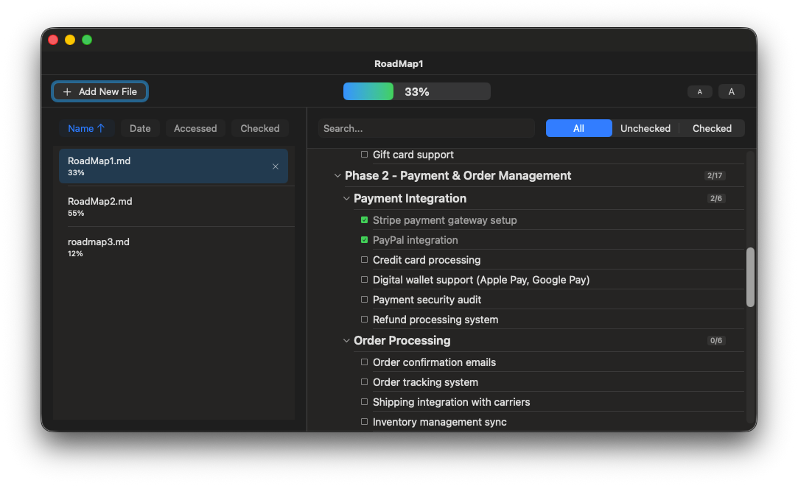
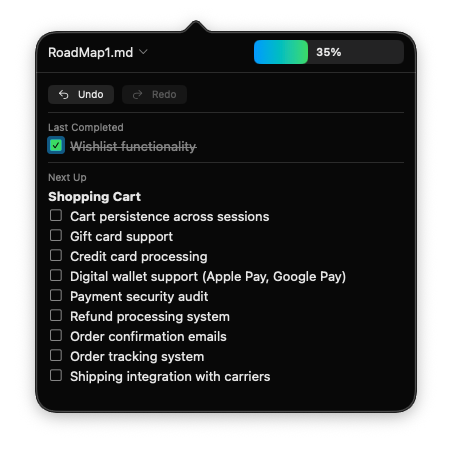

# ProjectProgressTracker


A macOS app for tracking progress on markdown checklists. Lives in your menu bar for quick access.

## Features

- Load and track multiple markdown files with checkboxes
- Visual hierarchy for nested headers and tasks
- Progress bar and completion percentage
- Menu bar popover with quick overview
- Undo/redo support
- Filter by checked/unchecked items
- Search across all items

## Screenshots

### Main Window


### Menu Bar


## Installation

**Mac App Store:** [Coming soon]

**Direct Download:** [Download DMG](https://github.com/Xpycode/ProjectProgressTracker/releases/latest)

## Usage

1. Click "Add New File" to load a markdown file with checkboxes
2. Click checkboxes to mark items complete
3. Use the menu bar icon for quick access
4. Progress syncs back to the original markdown file

## Markdown Format

The app works with standard markdown checkboxes:

```markdown
# Project Name

## Phase 1
### Feature A
- [x] Completed task
- [ ] Pending task

### Feature B
- [ ] Another task
```

## Requirements

- macOS 14.0 or later

## License

MIT
